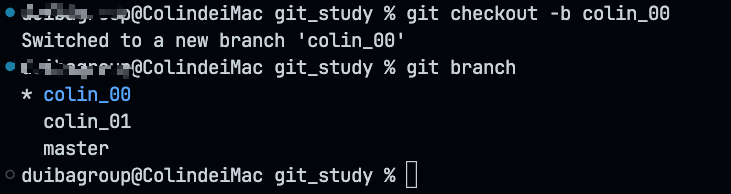

# 创建分支

## git命令

> 创建分支

```bash
git checkout -b <分支名> // 创建分支 并 切换
```
相当于  
```bash
git branch <分支名> 
git checkout <分支名> 
```
  

>发布分支（发布了才能提交）

```bash
git push --set-upstream origin <分支名> // 发布分支到 github/gitee..

或者  

git push -U origin <分支名> // 发布分支到 github/gitee..
```
> 删除分支

```bash
git branch -d <分支名> // 删除本地分支
git branch -D <分支名> // 删除有未合并更改的分支
git push origin --delete <分支名> // 删除远程分支
```