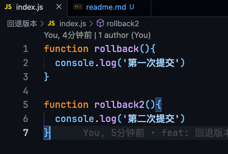
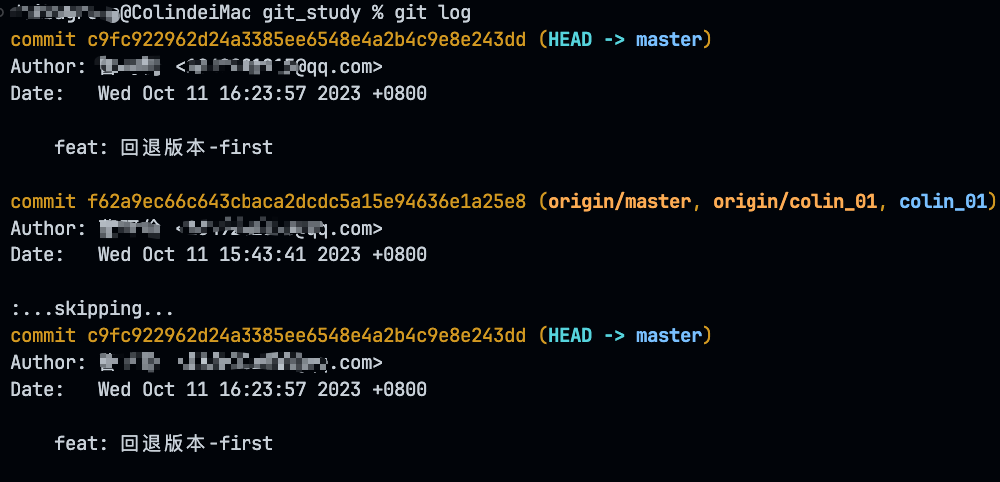
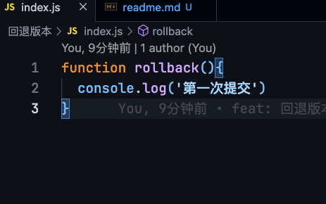
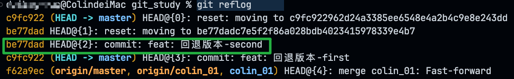
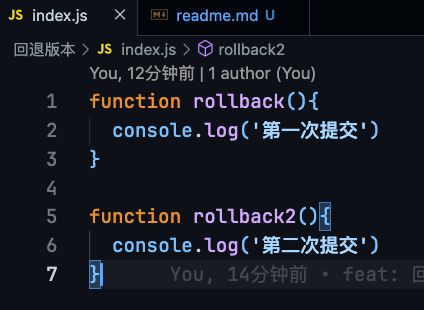

# 回退版本

## git命令
```bash
git log
```


```bash
git reset --hard <commitId> // commitId -> 要回退到某个版本的commit id
```



## 回退之后 如何再次回到第二次提交？
```bash
git reflog  // 查看历史版本
```


```bash
git reset --hard <HEAD@{2} || be77dad> // 可以看到我们这次回退记录 HEAD@{2} 或者 id：be77dad， 直接回退
```



```bash
git push origin remoteBranchName --force   
❗️ 如果你不想要已经push到github的某次提交 执行这个命令将会取消github的某次提交commit
```