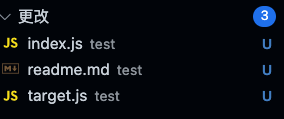
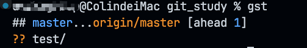
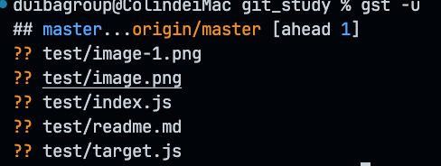
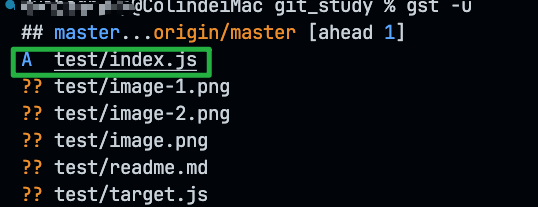
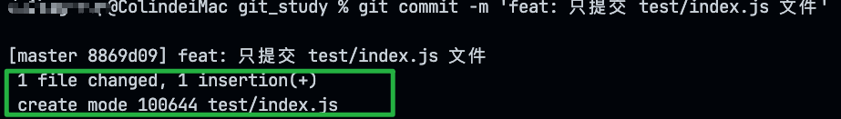
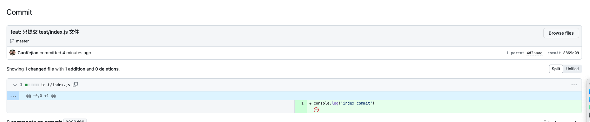

# 单独提交

## git命令

```bash
git status // 查看已更改的文件的状态
```
  


```bash
git status -u // -u 可以查看test下更加详细的更改记录（3个文件）
```


```bash
git add <test/index.js> // 只提交 test/index.js 这个文件
```
> 可以看到 test/index.js 已经在‘暂存的更改’里了

> 现在你就可以继续提交  
```bash
git commit -m 'feat: 只提交 test/index.js 文件'
git push
```
> 查看结果  
  
