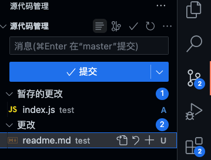
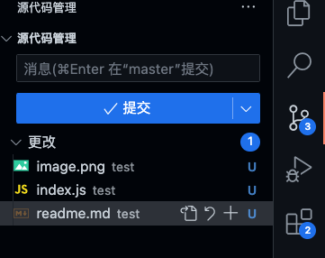
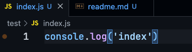
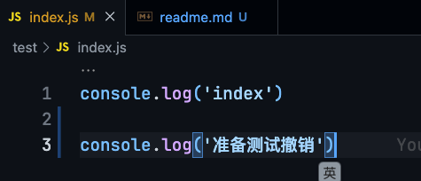

# 撤销提交

## git命令

> 撤销‘暂存区’的文件
  
```bash
git reset test/index.js // 撤销‘暂存区’的 test/index.js 撤销到‘更改’

git reset // 将暂存区的文件 ‘全部’ 撤销
```
  

> 撤销‘修改’的文件
### 确保 index.js 已经提交过commit，


```bash
git checkout -- test/index.js // git checkout -- 这个命令其实是“恢复”到版本控制里的代码【删除或恢复】
```